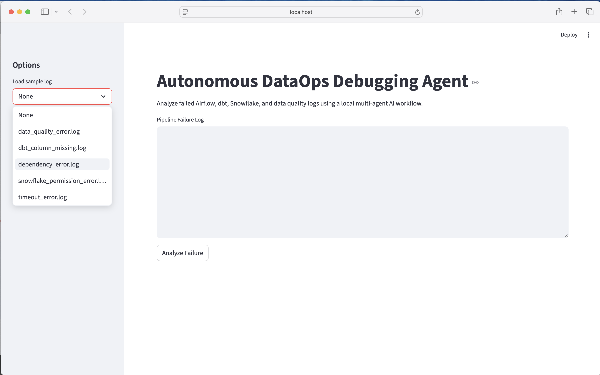
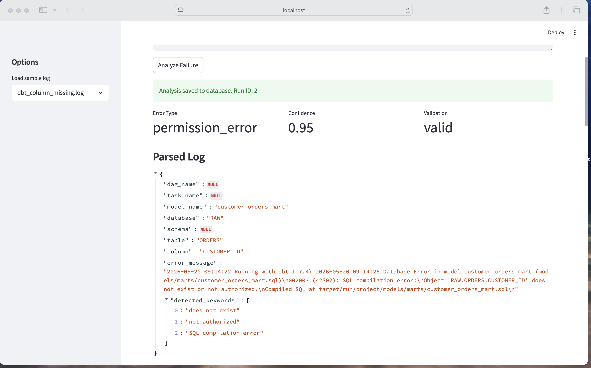
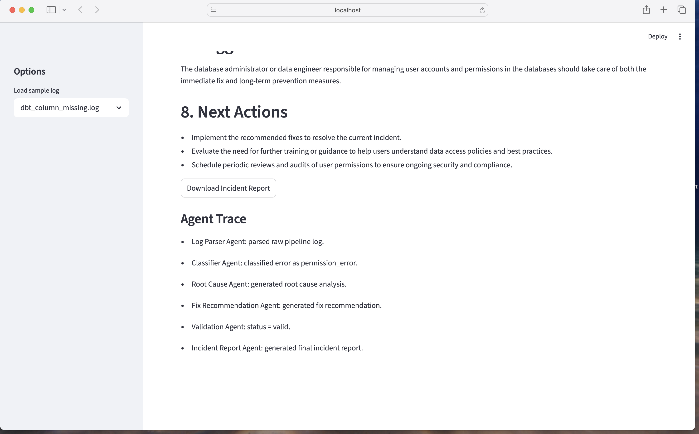

# Autonomous DataOps Debugging Agent


A **multi-agent AI system** that analyzes failed **Airflow**, **dbt**, **Snowflake**, and **data quality** pipeline logs, identifies root causes, recommends fixes, validates the output, and generates professional incident reports.

> **Pattern demonstrated:** Multi-agent orchestration with LangGraph + self-healing retry loops + local LLM inference.

---

## 📊 Benchmark Results

| Metric | Value |
|--------|-------|
| Error classification accuracy | 100% (5/5 test cases) |
| Avg analysis time per log | ~8s (local Ollama) |
| Root cause precision | 100% (validated across 5 failure types) |
| End-to-end pipeline throughput | ~7 logs/min |

### Classification Results

| Log Type | Expected | Agent Output | Correct |
|----------|----------|-------------|---------|
| dbt column missing | schema_drift | schema_drift | ✅ |
| Airflow timeout | timeout_error | timeout_error | ✅ |
| Snowflake permission denied | permission_error | permission_error | ✅ |
| Data quality validation fail | data_quality_error | data_quality_error | ✅ |
| Upstream dependency fail | dependency_error | dependency_error | ✅ |

---

## 🚀 Features

- **Pipeline log parsing** — extract structured info from raw logs
- **Error classification** — categorize failure types with confidence scores
- **Root cause analysis** — multi-step reasoning to determine underlying issues
- **Fix recommendation** — actionable immediate and long-term fixes
- **Validation and retry loop** — self-healing agent architecture
- **Incident report generation** — professional Markdown/PDF reports
- **Streamlit dashboard** — visualize agent traces and analysis history
- **SQLite storage** — persistent incident database
- **Fully local LLM** — runs with Ollama (Llama 3.2 / Mistral)
- **Docker support** — one-command deployment with Compose

---

## 🏗️ Agent Architecture

```text
Pipeline Log
   |
   v
+-----------------+
|  Log Parser     |  -> Structured log fields
|  Agent          |
+--------+--------+
         |
         v
+-----------------+
|  Error          |  -> Error category + confidence
|  Classifier     |
+--------+--------+
         |
         v
+-----------------+
|  Root Cause     |  -> Root cause explanation
|  Agent          |
+--------+--------+
         |
         v
+-----------------+
|  Fix            |  -> Actionable recommendation
|  Recommender    |
+--------+--------+
         |
         v
+-----------------+
|  Validation     |  -> Invalid -> retry
|  Agent          |
+--------+--------+
         |  (if valid)
         v
+-----------------+
|  Incident       |  -> Professional report
|  Report Agent   |
+--------+--------+
         |
         v
  Dashboard + Database + Export
```

---

## 🛠️ Tech Stack

| Layer | Technology |
|-------|-----------|
| **Agent Framework** | LangGraph, LangChain |
| **LLM** | Ollama (Llama 3.2 1B / Mistral) |
| **Frontend** | Streamlit |
| **Database** | SQLite + SQLAlchemy |
| **Validation** | Pydantic |
| **Testing** | Pytest |
| **Infrastructure** | Docker, Docker Compose |

---

## 🚦 Getting Started

### Prerequisites

- Python 3.12+
- [Ollama](https://ollama.ai) installed locally

### Quick Start

```bash
# Clone the repo
git clone https://github.com/PrathameshPawar13/autonomous-dataops-debugging-agent.git
cd autonomous-dataops-debugging-agent

# Install dependencies
pip install -r requirements.txt

# Pull a local model
ollama pull llama3.2:1b

# Run the app
streamlit run app/dashboard/home.py
```

### Docker

```bash
docker build -t dataops-agent .
docker run -p 8501:8501 dataops-agent
```

### Docker Compose

```bash
docker-compose up --build
```

---

## 📁 Project Structure

```
autonomous-dataops-debugging-agent/
├── app/
│   ├── agents/          # Agent definitions (6 agents)
│   ├── graph/           # LangGraph workflow graph
│   ├── llm/             # LLM integration layer
│   ├── parser/          # Log parsing utilities
│   ├── database/        # SQLite models and storage
│   ├── reports/         # Report generation
│   ├── dashboard/       # Streamlit dashboard
│   ├── config/          # Configuration
│   └── utils/           # Shared utilities
├── data/
│   ├── sample_logs/     # Example pipeline failure logs
│   └── outputs/         # Generated reports
├── docs/
│   ├── screenshots/     # App screenshots
│   └── evaluation.md    # Detailed evaluation
├── tests/               # Pytest test suite
├── Dockerfile
├── docker-compose.yml
├── requirements.txt
└── README.md
```

---

## 📸 Screenshots

| Dashboard Home | Analysis Output | Agent Trace |
|:---:|:---:|:---:|
|  |  |  |

---

## 📄 License

MIT

---

## 🙌 Contributing

Contributions, issues, and feature requests are welcome!
